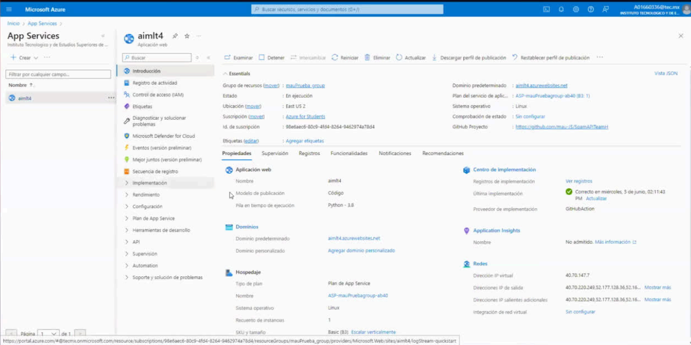
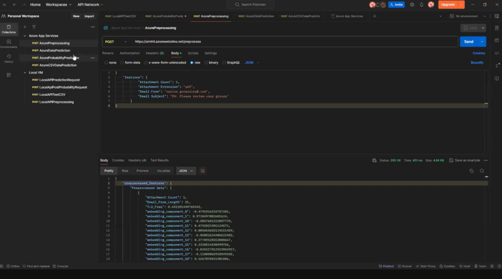

# Spam Detection Project

## Initial Notes
Due to NDA restrictions, We am unable to share details related to the model training process, as it involves sensitive company data. Sharing such information would violate NDA rules and could have serious consequences.  

However, I am able to share the preprocessing pipeline, which outlines the necessary steps for preparing data for NLP tasks. Please note that no datasets are included in this shared code.  

This project was developed in collaboration with **Beiersdorf AG**. The API was implemented using **Flask** and deployed with **Azure App Services**, a backend cloud service provided by Azure. By leveraging Azure's **CI/CD capabilities integrated with GitHub**, automatic updates were applied, enabling seamless tracking and implementation of necessary changes. This api was created in such a way that it was able to receive CSV files and return a prediction.  

### Azure Access Status
Since all resources for this project were provided by **Beiersdorf AG**, I no longer have access to any related Azure services (including Azure App Services and Azure VMs). As a result, GitHub CI/CD integration displays an inactive status.

## Requirements
* For this code to work it needs Python 3.8, as Gensim library reaches up to 3.9 Python compatibility.
* Azure App Service deployment, unfortunately, access to this service is not longer granted. It is really important you azure app service applications have the previous Python version.
* requirements.txt so libraries needed are installed into Azure App Services and everything can run properly.

## Features
* Attachment Count
* Email Length
* Email Subject
* Top level domain
* Email Subject

## NLP Preprocessing
We used nltk, gensim, and wordcloud. We also used email.utils to find common domains.
* We obtained the Top level Domain frequency to use it as a feature.
* For the NLP process, we were requested to be able to detect 5 languages: English, Spanish, French, German, and Italian. With aid of nltk library we included them.
* Creating our corpus using the email given data.
* Detected and removed stopwords using 'stopwords' from nltk.
* Tokenized given email text.
* Emoji library allows emoji detection on mails, as they can also be common.
* Using a lemattizer to reduce words to their base or root form
* We extract top level domain as a feature from email data.

### Word Embedding
* Transformed tokens into numerical vector representations using a pre-trained **Word2Vec** model.
* If a token was absent in the model's vocabulary, a zero vector was returned as a fallback.
* Constructed a DataFrame incorporating features such as:
  - **Attachment Count**
  - **Email Length**
  - **Top-Level Domain Frequency**
  - **Word Embeddings (One-Hot Encoding)**

### Modeling
We used the following:
* Support Vector Machine
* Random Forest
* Gradient Boosting
* CNN (Convolutional Neural Networks)
* RNN (Recurrent Neural Networks)

For a complete overview look at the following created article:
[Complete Project Documentation](./docs/scientific_article.pdf)

### API Implementation
Developed three API endpoints:
1. **Prediction API** – Accepts feature inputs and returns a classification result.
2. **Probability API** – Accepts feature inputs and returns class probabilities.
3. **CSV-Based Prediction API** – Processes a CSV file, applying predictions to all entries.

  

### Endpoints
  
